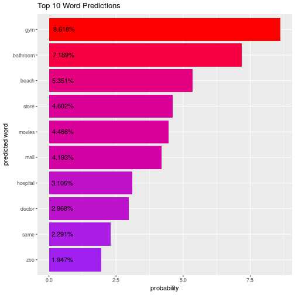

TextPred
========================================================
author: Peter Thompson
date: September 5, 2017
autosize: true

Slide 1
========================================================

TextPred - text prediction app

Slide 2
========================================================

Text pred - shiny app for next word prediction
based of data from twitter, news and blog posts
based on shiny/R
hosted on shinyapps

Slide 3
========================================================

loading screen displays while app initialises
bar chart displays most likely words, and their predicted probabilities

Slide 4
==========================================================

based on interpolated Kneser-Ney model
code in github

